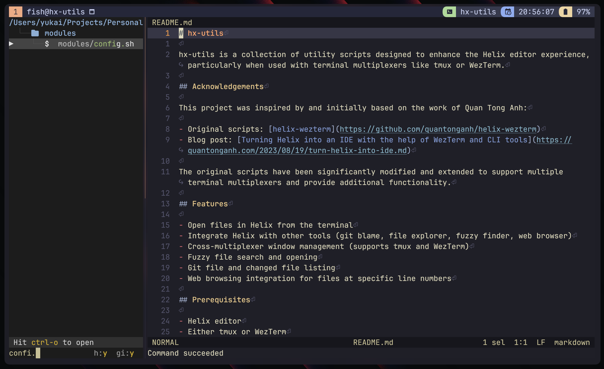
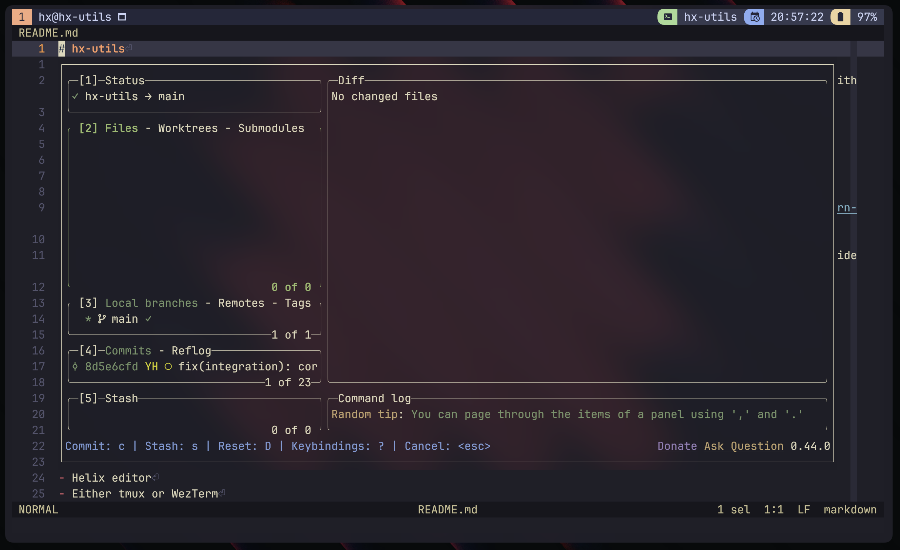
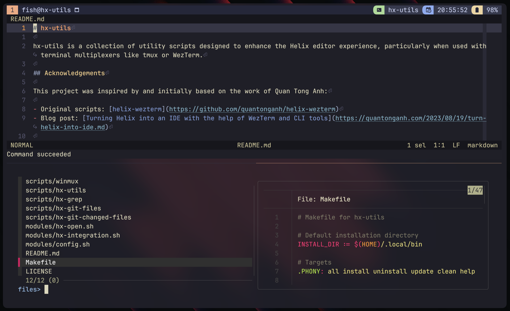

# hx-utils

hx-utils is a collection of utility scripts designed to enhance the Helix editor experience, particularly when used with terminal multiplexers like tmux or WezTerm.

## Acknowledgements

This project was inspired by and initially based on the work of Quan Tong Anh:

- Original scripts: [helix-wezterm](https://github.com/quantonganh/helix-wezterm)
- Blog post: [Turning Helix into an IDE with the help of WezTerm and CLI tools](https://quantonganh.com/2023/08/19/turn-helix-into-ide.md)

The original scripts have been significantly modified and extended to support multiple terminal multiplexers and provide additional functionality.

## Features

- Open files in Helix from the terminal
- Integrate Helix with other tools (git blame, file explorer, fuzzy finder, web browser)
- Cross-multiplexer window management (supports tmux and WezTerm)
- Fuzzy file search and opening
- Git file and changed file listing
- Web browsing integration for files at specific line numbers

## Screenshots







## Prerequisites

- Helix editor
- Either tmux or WezTerm
- ripgrep (rg)
- fzf
- bat
- Git
- `broot` (for the file explorer functionality)
- `gh` (GitHub CLI for browsing files in a web browser)

## Installation

1. Clone the repository:

   ```bash
   git clone https://github.com/Yukaii/hx-utils.git
   cd hx-utils
   ```

2. Run the setup script:

   ```bash
   ./setup.sh
   ```

   This script will check for dependencies, install the utilities, and add them to your PATH.

## Usage

### Example Helix Configuration

Below is an example configuration for integrating hx-utils with Helix.

```toml
# Terminal actions
[keys.normal.space.t]
b = ":sh winmux sp fish > /dev/null"
B = ":sh hx-utils blame > /dev/null"
l = ":sh winmux popup lazygit > /dev/null"

[keys.normal.space]
e = ":sh hx-utils explorer"

[keys.normal.space.f]
g = ":sh hx-utils git-files > /dev/null"
w = ":sh hx-utils grep > /dev/null"
d = ":sh hx-utils git-changed-files > /dev/null""
```

### hx-utils Commands

The main utility script `hx-utils` provides several subcommands:

- **open**: Opens a file in Helix, with options for split direction, pane type, and size.
- **blame**: Displays Git blame information for the current file.
- **explorer**: Opens a file explorer using `broot` and integrates with tmux or WezTerm.
- **grep**: Performs a search using `ripgrep` within the project.
- **browse**: Opens the current file at the specified line in a web browser using `gh browse`.
- **git-files**: Lists files tracked by Git.
- **git-changed-files**: Lists files that have changed in Git.

```bash
hx-utils open [FILE]
hx-utils blame
hx-utils explorer
hx-utils grep
hx-utils browse
hx-utils git-files
hx-utils git-changed-files
```

### Subcommands Overview

- **open**: Opens files in Helix, with options to control how the file is opened within the editor.

  ```bash
  hx-utils open [FILE] [DIRECTION] [SPLIT] [PERCENT]
  ```

  Options:

  - `FILE`: The file to open.
  - `DIRECTION`: The direction to split the pane (default: right).
  - `SPLIT`: The type of split ('v' for vertical, 'h' for horizontal, default: vertical).
  - `PERCENT`: The percentage size of the pane (default: 80%).

- **blame**: Displays Git blame information for the current file in a pane.

  ```bash
  hx-utils blame
  ```

- **explorer**: Opens a file explorer using `broot` with integration for tmux or WezTerm.

  ```bash
  hx-utils explorer
  ```

- **grep**: Searches for a pattern using `ripgrep` and displays the results.

  ```bash
  hx-utils grep [PATTERN]
  ```

- **browse**: Opens the current file and line number in the web browser using GitHub’s `gh browse`.

  ```bash
  hx-utils browse
  ```

- **git-files**: Lists all files tracked by Git.

  ```bash
  hx-utils git-files
  ```

- **git-changed-files**: Lists all files changed in the current Git branch.

  ```bash
  hx-utils git-changed-files
  ```

### winmux

A cross-multiplexer window management utility. It supports both tmux and WezTerm for managing windows and panes.

```bash
winmux [OPTION]... [COMMAND] [ARGS]...
```

Options:

- `-m, --mode`: Set the mode to 'tmux' or 'wezterm'.
- `-p, --percent`: Set the size of the panel as a percentage.
- `-h, --help`: Display help and exit.

Commands:

- `vsp`: Split vertically.
- `sp`: Split horizontally.
- `focus-left`, `focus-right`, `focus-up`, `focus-down`: Focus on adjacent panes.
- `popup`: Create a popup window.

### hx-open

`hx-open` is a standalone script designed to open files in the Helix editor from the terminal or other programs. It supports both tmux and WezTerm terminal multiplexers.

#### Usage

```bash
hx-open [OPTIONS] [FILE]
```

#### Options

- `-m, --mode [tmux|wezterm]`: Specify the multiplexer mode. Auto-detected if not specified.
- `-d, --direction [DIRECTION]`: Specify the pane direction ('top', 'bottom', 'left', 'right'). Default is 'right'.
- `-s, --split [TYPE]`: Specify the split type ('v' for vertical, 'h' for horizontal, 'none' for no split).
- `-p, --percent [PERCENT]`: Specify the default panel size percentage. Default is 80%.
- `-h, --help`: Display help and exit.

## Updating

To update hx-utils to the latest version:

1. Pull the latest changes from the repository:

   ```bash
   git pull origin main
   ```

2. Run the update script:

   ```bash
   make update
   ```

## Uninstalling

To uninstall hx-utils:

```bash
make uninstall
```

## License

This project is licensed under the MIT License - see the [LICENSE](LICENSE) file for details.
